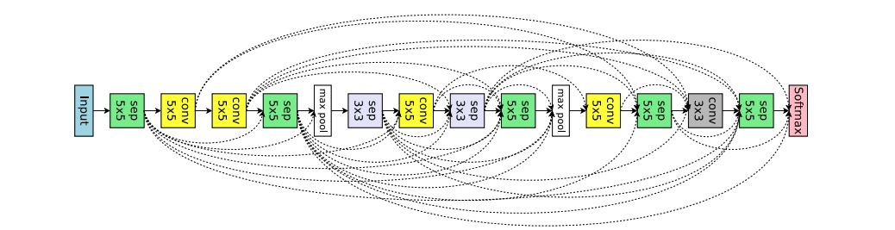

# Keras_functional_api_DNN

## The goal was to replicate a network in the below paper and get an understanding of using Keras functional API.
https://arxiv.org/pdf/1802.03268.pdf

### Design Approach
- Dataset used : CIFAR 10
- Keras functional API used for merge and skip connections
- For skip connections across maxpooling - used conv 2x2 using stride of 2.This is done to enable same size channel size for concatenation. If the skip is across 2 maxpooling - 4x4 conv with stride of 4 was used.
- Batch Normalization and Relu was enabled via function apis after each layer (except the last layer)

### Observations and Learning
- For a fairly deep network , the numer of parameters was still not very large < 0.5 MM
- Overfitting observed.
- Validation loss kept increasing and fluctuated
- With epochs = 100. Validation accuracy of 78.05%.
